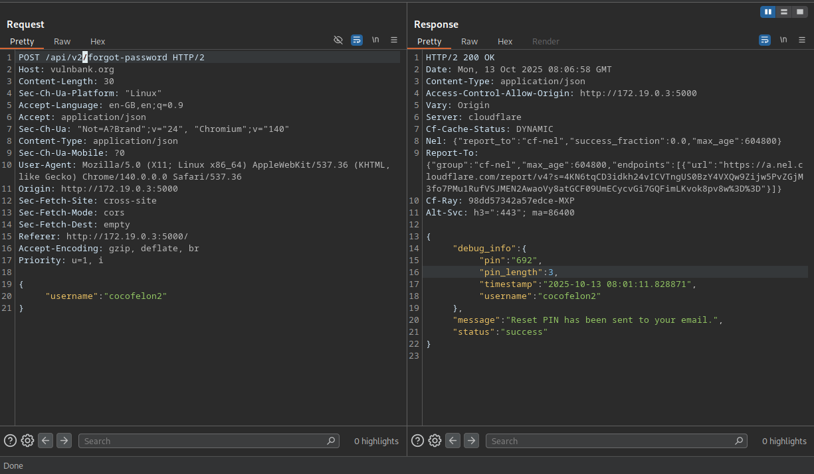
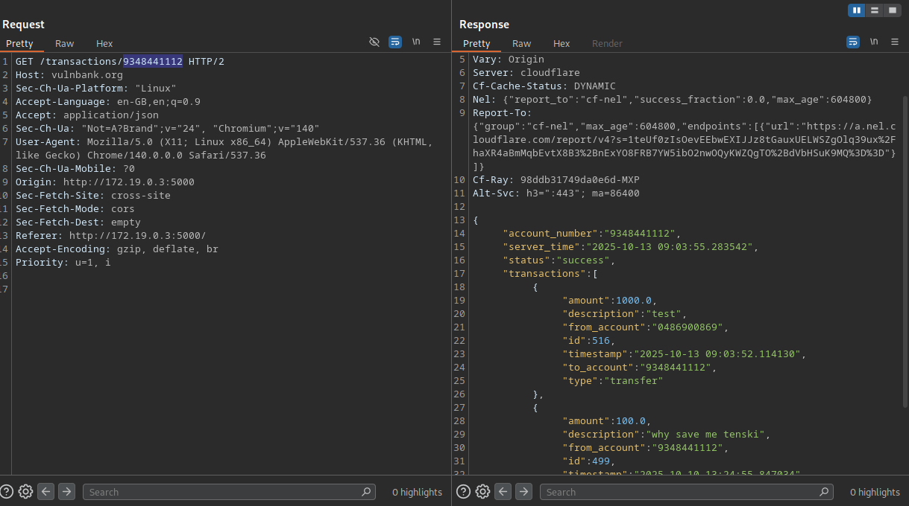
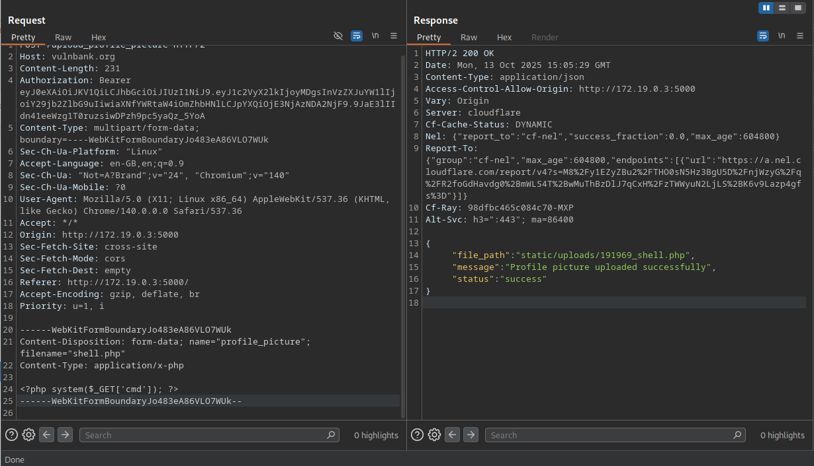
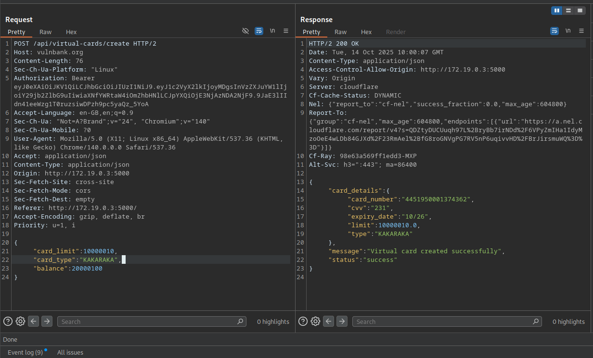

> **CONTINUING THE HEIST:** In Part 1, I showed you how to become bank manager and drain accounts. Now let me show you the supporting vulnerabilities that make the attack complete. Same rules apply — authorized testing only!

Welcome back to the VulnBank takedown! In Part 1, I showed you the big guns — SQL injection to steal accounts, privilege escalation to become admin, and unauthorized payments to empty vaults. But every good heist needs a supporting crew.

Today we're covering the 10 additional vulnerabilities that turn a simple breach into a complete system takeover. These are the IDORs, information disclosures, and misconfigurations that let attackers move silently and gather intel before striking.

> **Missed Part 1?** Catch up on the critical vulnerabilities first! [Read Part 1: The Big Hitters](/blog/i-hacked-a-bank)

## The Information Gathering Phase

### Information Disclosure — The API Version Downgrade Trick
**Severity: HIGH — 7.5 CVSS**

While poking around the password reset functionality, I discovered something beautiful — API version downgrade attacks:

```
# Version 2 - basic info
POST /api/v2/forgot-password
{"username": "victim"}

# Version 1 - FULL DATA LEAK
POST /api/v1/forgot-password  
{"username": "victim"}
# Response: {"card_pin": "1234", "pin_length": 4}
```

By simply changing `v2` to `v1` in the endpoint, the API spilled everyone's card PINs.



### Balance Disclosure — Peeking at Everyone's Wallet
**Severity: MEDIUM — 5.3 CVSS**

```
GET /balance/123456789
# No authentication needed!
# Response: {"balance": 42069.69}
```

No authentication, no ownership checks. Just feed it any account number.

## The IDOR Army — Broken Access Control Everywhere

### Transactions IDOR — Reading Everyone's Financial Diary
**Severity: HIGH — 7.5 CVSS**

```
GET /transactions/123456789
# Response: Full transaction history
```



### Authenticated SQL Injection — The Gift That Keeps Giving
**Severity: HIGH — 8.8 CVSS**

Because one SQL injection wasn't enough, I found another one that works even after authentication:

```
POST /some-authenticated-endpoint
{
    "account_number": "' OR 1=1 --",
}
```

Even after logging in properly, I could still inject SQL through various parameters.

## The File Upload Fiasco

### Unrestricted File Upload
**Severity: HIGH — 7.2 CVSS**

The profile picture upload feature accepted any file type — PHP shells, EXEs, massive files. The server just happily stored whatever I sent.



## The Virtual Card Collection

### Arbitrary Card Creation
**Severity: HIGH — 7.1 CVSS**

```
POST /api/virtual-card/create
{
    "card_type": "unlimited_black_card",
    "credit_limit": 9999999
}
```

The server accepted any card type and any extra fields. Mass assignment strikes again!

### Get Cards Disclosure — Seeing Everyone's Virtual Wallets
**Severity: MEDIUM — 6.5 CVSS**

Once I had access to the virtual cards endpoint, I could see everyone's cards with no filtering or access controls.

### Card Freezing IDOR — Remote Account Locking
**Severity: HIGH — 7.7 CVSS**

```
POST /api/virtual-cards/foreign_card_id_123/freeze
# Response: {"status": "frozen"}
```

Instant denial-of-service for any user.

### Card Limit Update IDOR
**Severity: HIGH — 8.1 CVSS**

```
POST /api/virtual-cards/foreign_card_id_123/update-limit
{"new_limit": 0}  # Or 1000000, dealer's choice
```

Complete control over other people's financial limits.



## Putting It All Together: The Complete Attack Chain

```
# Phase 1: Reconnaissance
1. SQL injection to dump all account numbers
2. Balance disclosure to identify high-value targets
3. API version downgrade to steal card PINs

# Phase 2: Establishment  
4. Unrestricted file upload for backdoor persistence
5. Privilege escalation to admin for full control

# Phase 3: Attack
6. Mass assignment to create unlimited funds
7. Unauthorized payments to transfer money
8. Card freezing for targeted denial-of-service
9. Race condition for infinite money glitch
```

| Severity | Count |
|---|---|
| CRITICAL | 4 — SQL Injection, SSRF, Privilege Escalation, Unauthorized Payments |
| HIGH | 10 — Mass Assignment, Brute Force, Race Condition, Info Disclosure, File Upload, Card IDORs |
| MEDIUM | 3 — Balance Disclosure, Get Cards, Card Transactions |

## Final Thoughts: Why This Matters

This wasn't just about finding bugs — it was about understanding attack chains. Individual vulnerabilities are bad, but chained together they're catastrophic.

What scared me most wasn't any single vulnerability, but how they all worked together. The lack of defense in depth meant that breaching one layer gave access to everything.

For developers and security teams: Test holistically. Don't just look for individual bugs — look for how they can be combined. Because attackers definitely will.

> **Security Disclaimer:** This assessment was conducted ethically in a controlled lab environment. All vulnerabilities were reported to the appropriate parties. Never test systems without explicit authorization.
