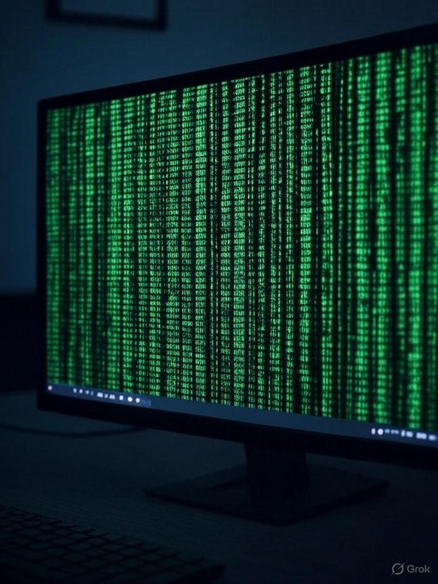

Technology has woven itself into the very fabric of our existence, transforming how we communicate, work, and dream. From the early days of clunky computers to the sleek devices that fit in our pockets, the journey has been nothing short of revolutionary.

> **Consider the smartphone:** a portal to infinite knowledge, a camera superior to anything in a professional studio just a decade ago, and a social hub that connects us across continents in seconds. Yet, beneath this glossy surface lies a complex web of algorithms, data streams, and ethical dilemmas that we often overlook in our daily swipe.

## The Double-Edged Sword

Technology empowers, but it also ensnares. Social media platforms, designed to bring us closer, frequently amplify division and misinformation. AI, our latest marvel, promises efficiency but raises specters of job displacement and biased decision-making.

In the realm of cybersecurity, what was once a niche concern for governments now haunts every individual. Hackers exploit vulnerabilities faster than patches can be deployed, turning our connected world into a battlefield of digital espionage.

### The Cybersecurity Challenge

- **Rapid Vulnerability Exploitation** — Attack windows shrinking from days to hours
- **AI-Powered Threats** — Machine learning used for sophisticated social engineering
- **Supply Chain Attacks** — Compromising trusted software dependencies
- **Zero-Day Markets** — Underground economies for undisclosed vulnerabilities

## Hope on the Horizon

Yet, hope persists. Innovations in renewable energy, telemedicine, and quantum computing herald a future where technology heals as much as it disrupts. The key lies in mindful adoption — harnessing these tools not as masters, but as allies in our quest for progress.

As we stand at this crossroads, one question echoes: Will we steer technology toward enlightenment or allow it to chart a course of unintended consequences?

The answer, as always, rests in our hands.

> **Reflection:** May our digital odyssey lead us to brighter tomorrows.

*Originally published on [Medium](https://medium.com/@aweemmanuel351/technology-today-367e2aa67c7b).*
